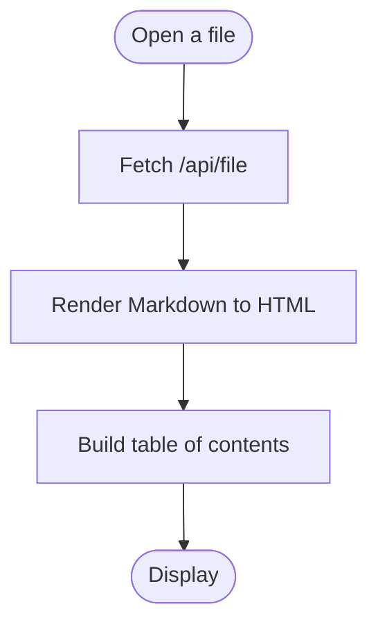

# Formatting Showcase

Everything on this page exercises a different part of the renderer.

## Text

Plain text supports **bold**, *italic*, ***bold italic***, ~~strikethrough~~, `inline code`,
and [links](https://commonmark.org). Here's a footnote reference[^1].

[^1]: Footnotes render at the bottom of the page and link back to their reference.

## Lists

- Unordered items
  - Nested one level
    - Nested two levels
- Back to the top level

1. Ordered items
2. Keep their numbering
   1. Even when nested
3. Automatically

Task lists:

- [x] Ship the file tree
- [x] Wire up live preview
- [ ] Add multi-file search highlighting

## Blockquotes

> Good writing is clear thinking made visible.
>
> — attributed to many people, credited to none reliably

## Tables

| Feature | Status | Notes |
|---|:---:|---|
| Tables | ✅ | GFM pipe tables |
| Task lists | ✅ | Checkbox rendering |
| Footnotes | ✅ | See below the page |
| Math | ✅ | KaTeX, inline and block |
| Diagrams | ✅ | Mermaid |

## Code blocks

```csharp
public record Heading(string Id, string Text, int Level);

public class MarkdownRenderer
{
    public (string Html, List<Heading> Headings) Render(string markdown)
    {
        var doc = Markdown.Parse(markdown, _pipeline);
        return (doc.ToHtml(_pipeline), ExtractHeadings(doc));
    }
}
```

```javascript
async function openFile(path) {
  const res = await fetch(`/api/file?path=${encodeURIComponent(path)}`);
  const data = await res.json();
  renderPane.innerHTML = data.html;
  buildToc(data.headings);
}
```

```python
def slugify(text: str) -> str:
    return "-".join(
        word.lower() for word in text.split() if word.isalnum()
    )
```

## Diagrams



## Math

Inline: the quadratic formula is $x = \dfrac{-b \pm \sqrt{b^2 - 4ac}}{2a}$.

Block:

$$
\sum_{i=1}^{n} i = \frac{n(n+1)}{2}
$$

$$
\begin{aligned}
\nabla \times \vec{E} &= -\frac{\partial \vec{B}}{\partial t} \\
\nabla \times \vec{B} &= \mu_0 \vec{J} + \mu_0 \epsilon_0 \frac{\partial \vec{E}}{\partial t}
\end{aligned}
$$

## Definition lists

Markdown
: A lightweight markup language for formatting plain text.

Markdig
: The .NET library that parses and renders it in this app.

## Emoji

Shipped :rocket: tested :white_check_mark: documented :books:

## Horizontal rule

---

That's everything. Try switching to edit mode and changing something above — the preview updates as you type.
