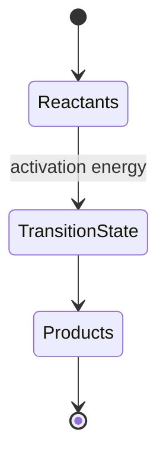

# Math & Science Notes

A worked example showing math rendering alongside prose, the way a study note would look.

## Kinematics

For constant acceleration $a$, starting velocity $v_0$, and time $t$:

$$
v(t) = v_0 + a t
$$

$$
x(t) = x_0 + v_0 t + \frac{1}{2} a t^2
$$

Eliminating $t$ gives the useful form $v^2 = v_0^2 + 2a\,(x - x_0)$.

## A quick derivative table

| Function | Derivative |
|---|---|
| $x^n$ | $n x^{n-1}$ |
| $\sin(x)$ | $\cos(x)$ |
| $e^x$ | $e^x$ |
| $\ln(x)$ | $1/x$ |

## Matrix notation

$$
A = \begin{bmatrix} 1 & 2 \\ 3 & 4 \end{bmatrix}, \quad
\det(A) = 1 \cdot 4 - 2 \cdot 3 = -2
$$

## Reaction lifecycle (diagram, not math, but neighbors well)

