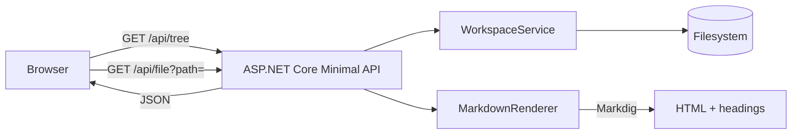
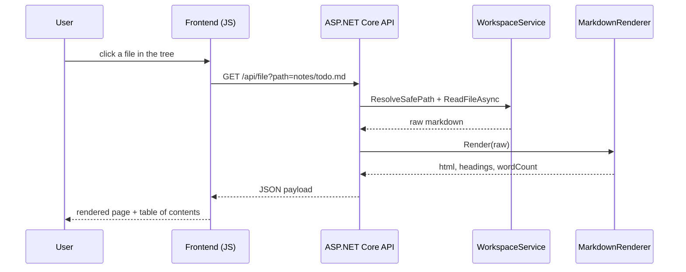

# Architecture

A quick tour of how a request flows through the app.

## Request sequence for opening a file

Every path coming from the client is re-validated against the configured workspace root in `WorkspaceService.ResolveSafePath`, so `..` segments and absolute paths are rejected before anything touches the disk.
